# DevLens Website Behavior Analyzer

DevLens is a front-end website audit dashboard powered by the Google PageSpeed Insights API. It lets a user enter a URL and view Lighthouse-based results for performance, accessibility, SEO, best practices, and issue severity in a polished interactive UI.

This project is designed as a portfolio-friendly static web app. It is especially useful for learning how HTML, CSS, JavaScript, API calls, and dashboard rendering work together.

## Preview

  ### DEsktop Preview
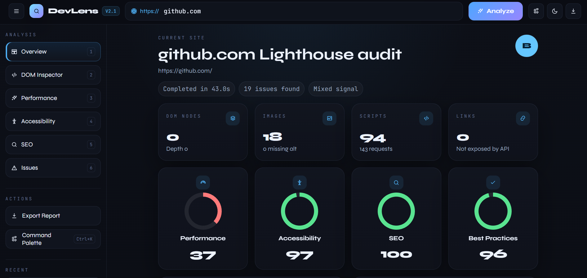
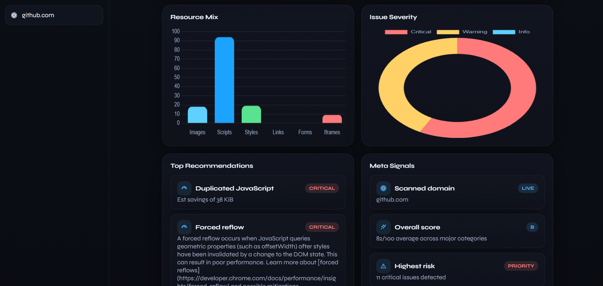
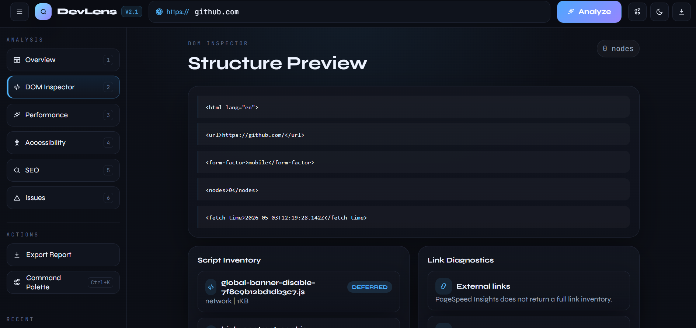
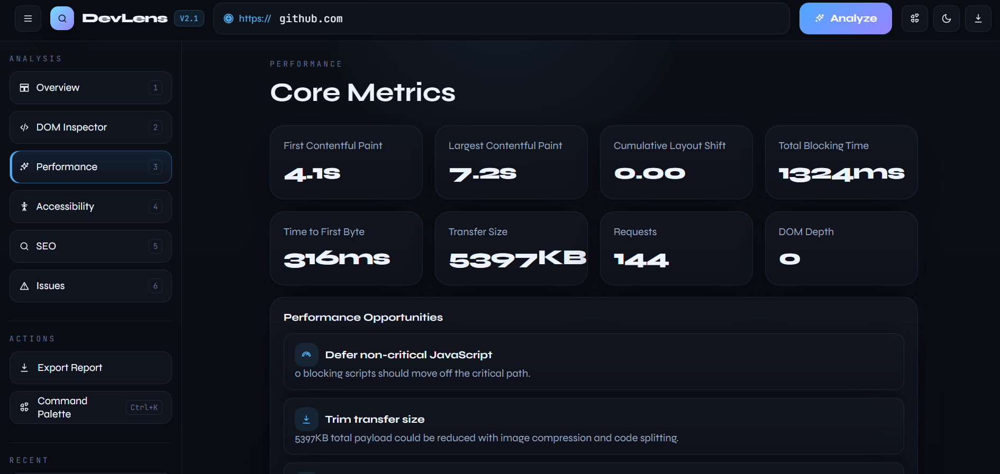
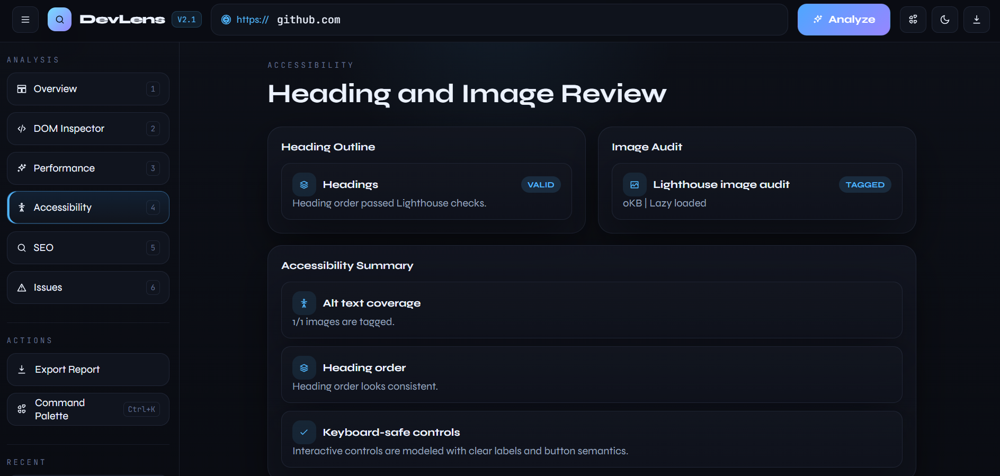
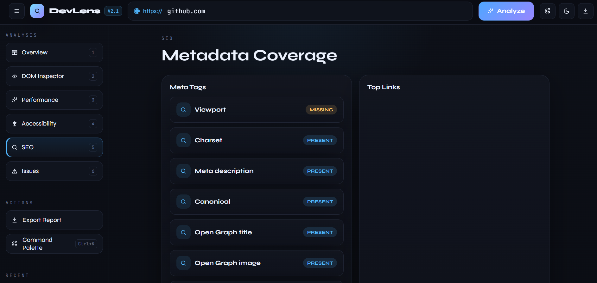
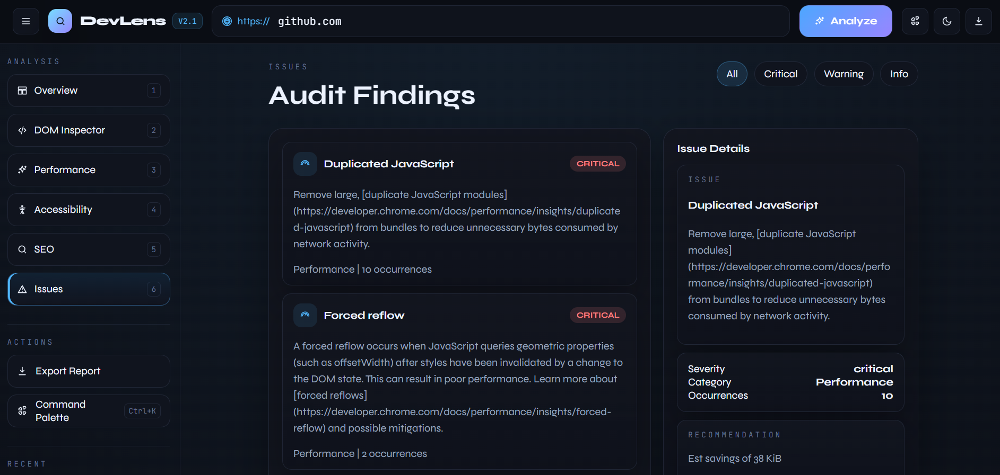


  ### Tablet Preview

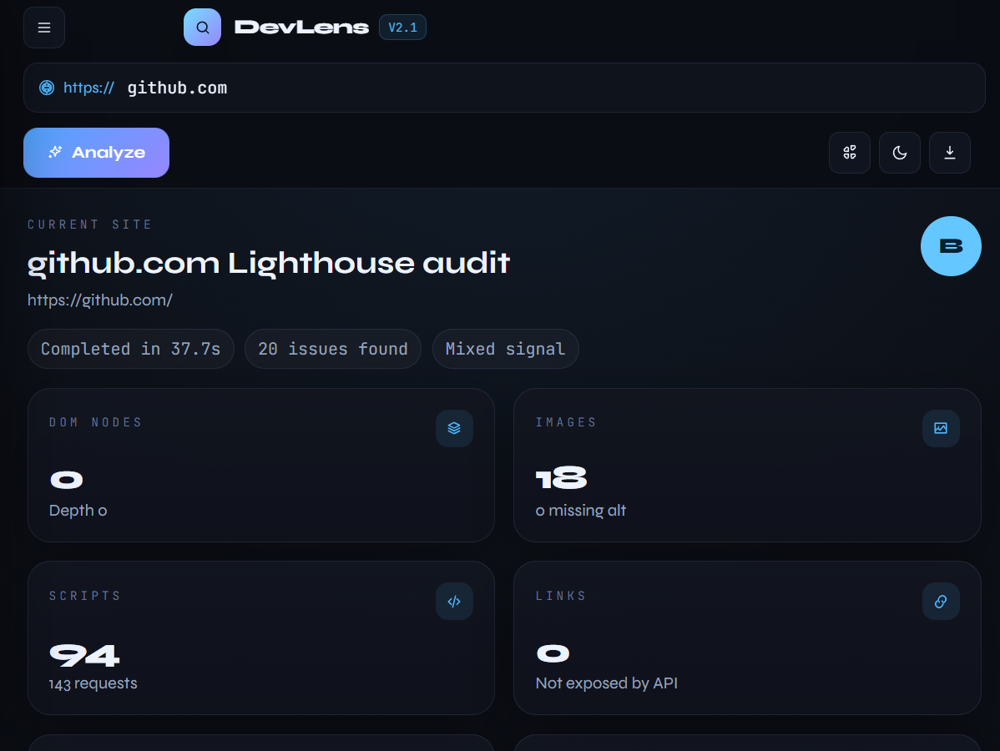
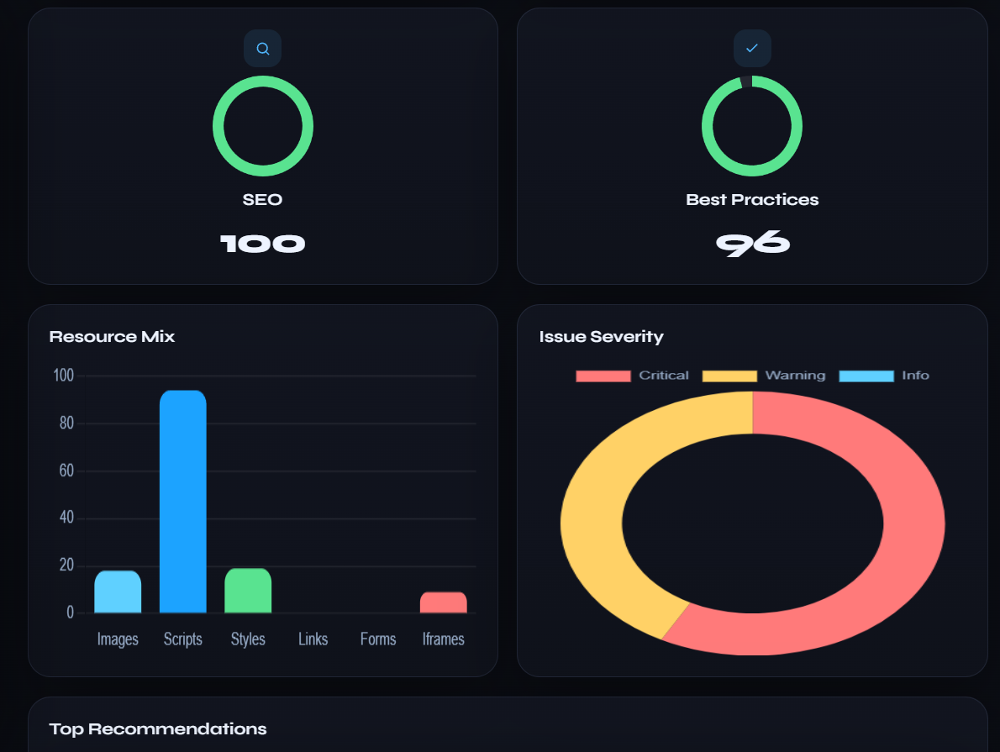
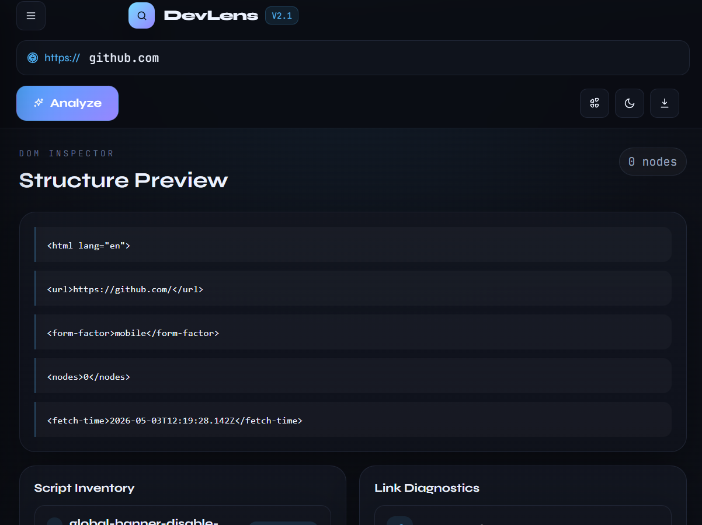
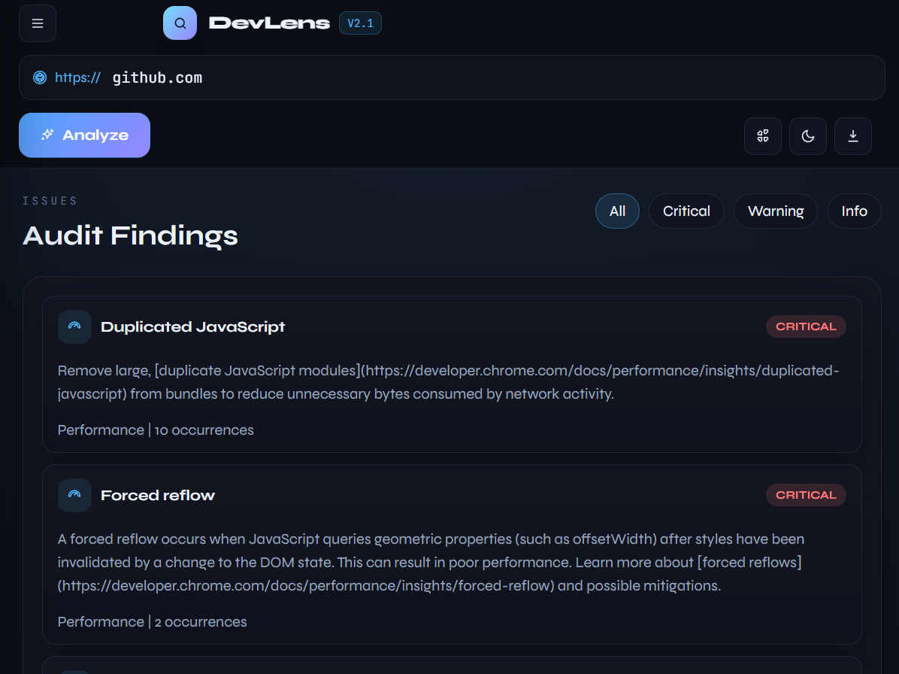
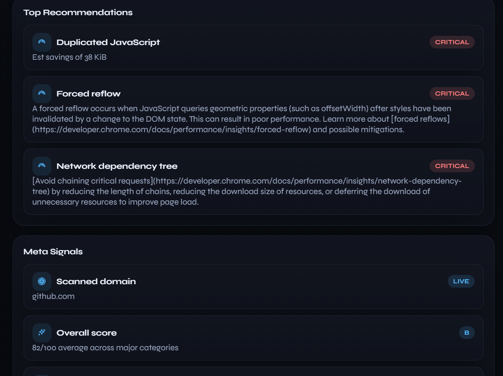

  ### Mobile View

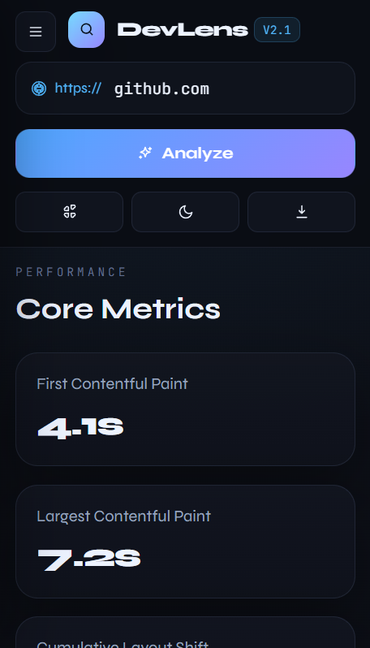
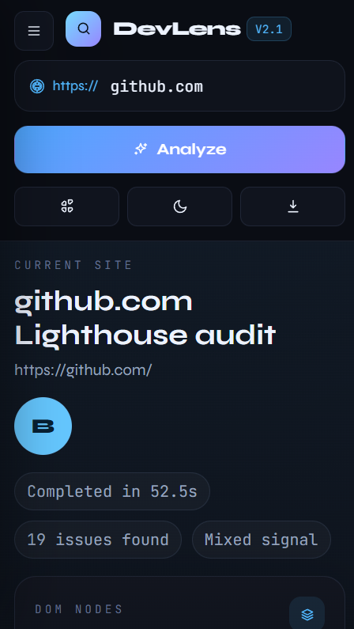
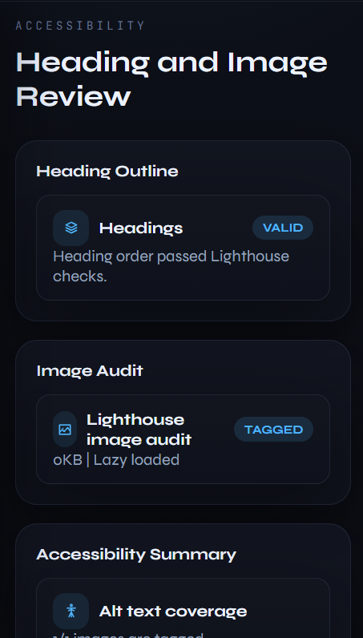
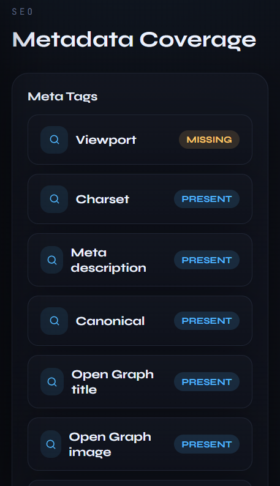
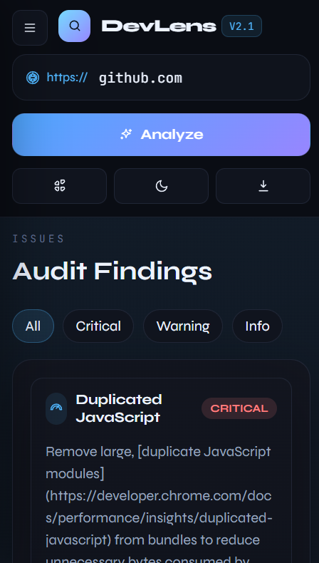
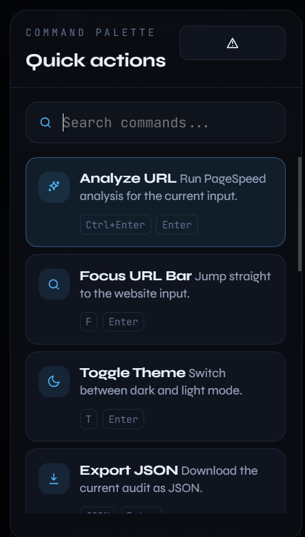
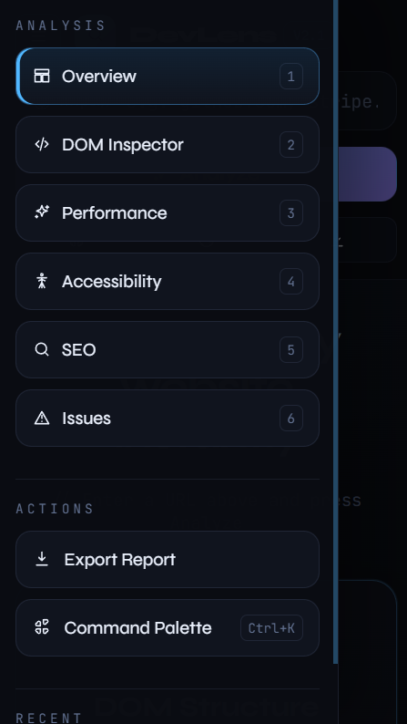


## Features

- Analyze a website URL with Google PageSpeed Insights
- View six main sections: Overview, DOM Inspector, Performance, Accessibility, SEO, and Issues
- Explore Lighthouse score cards, charts, issue summaries, and detail panels
- Export audit data as JSON or HTML
- Switch between complete dark and light themes, with the chosen theme saved locally
- Use a command palette with search, quick navigation, theme toggle, analyze, and export actions
- Use a responsive layout for desktop, tablet, and mobile screens

## Project Structure

```text
DevLens Website Behavior Analyzer/
|-- assets/
|   |-- css/
|   |   `-- style.css
|   |-- images/
|   |   `-- Screenshots/
|   `-- js/
|       |-- config.local.js       # ignored local API key file
|       |-- config.example.js
|       `-- script.js
|-- index.html
`-- README.md
```

## Technologies Used

- HTML5
- CSS3
- JavaScript (Vanilla JS)
- Chart.js
- Google PageSpeed Insights API
- Google Fonts

## How It Works

The app calls the Google PageSpeed Insights API directly from the browser. PageSpeed runs Lighthouse against the submitted URL and returns category scores, lab metrics, resource summaries, and audit recommendations.

When a user enters a URL and presses Analyze:

1. JavaScript normalizes the URL input.
2. The app requests a mobile Lighthouse analysis from PageSpeed Insights.
3. The API response is transformed into the dashboard data model.
4. The app stores that data in memory.
5. The dashboard updates the visible cards, charts, metrics, and issue lists.

Some deep DOM details, such as a complete list of every link or form on the page, are not exposed by PageSpeed Insights. DevLens shows real API-backed data where it is available and labels unavailable areas honestly.

## Main Concepts Used

- **API Integration** - Calling PageSpeed Insights and transforming Lighthouse JSON
- **DOM Manipulation** - Selecting, traversing, and dynamically updating elements
- **Event Handling** - Managing user interactions such as clicks, inputs, and UI controls
- **Asynchronous JavaScript** - Handling async operations with `fetch` and Promises
- **Responsive Design** - Building layouts with Flexbox and CSS Grid
- **Component-Style Rendering** - Organizing vanilla JavaScript into reusable render functions
- **Data Visualization** - Displaying insights using Chart.js
- **Theme Management** - Switching CSS variables and redrawing chart colors for dark/light mode
- **Command Palette UI** - Searching and running quick actions with keyboard support
- **Conditional Rendering** - Dynamically showing insights, warnings, and states
- **State Management** - Managing app state without a JavaScript framework
- **Accessibility Analysis** - Reading Lighthouse accessibility audits
- **Performance Metrics** - Displaying real Lighthouse lab metrics

## Running the Project

Because this is a static project, you can run it by opening `index.html` in a browser.

For a smoother local workflow:

1. Open the project folder in VS Code.
2. Use a Live Server extension or any simple static server.
3. Launch the page in your browser.

## API Notes

DevLens uses this endpoint:

```text
https://pagespeedonline.googleapis.com/pagespeedonline/v5/runPagespeed
```

The current version requests mobile Lighthouse data for these categories:

- Performance
- Accessibility
- Best Practices
- SEO

For larger usage, a backend proxy and API key are recommended so API quota and keys can be managed safely.

If the public quota is exhausted, DevLens will ask for a Google PageSpeed Insights API key. The key is stored in the current browser using `localStorage` and is not written into the project files.

For local development, you can also create this ignored file:

```text
assets/js/config.local.js
```

Use `assets/js/config.example.js` as the template and place your own PageSpeed API key there. Do not commit `config.local.js` to GitHub.

## Future Improvements

- Add a backend proxy for higher API quota and private API keys
- Save report history in local storage
- Add desktop and mobile strategy switching
- Support GitHub Pages deployment

## Author

Created by Subhan.

GitHub: https://github.com/Subhan46-web

LinkedIn: linkedin.com/in/subhanraza
