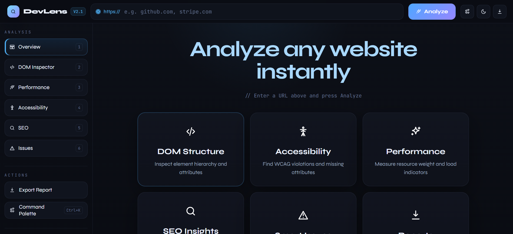
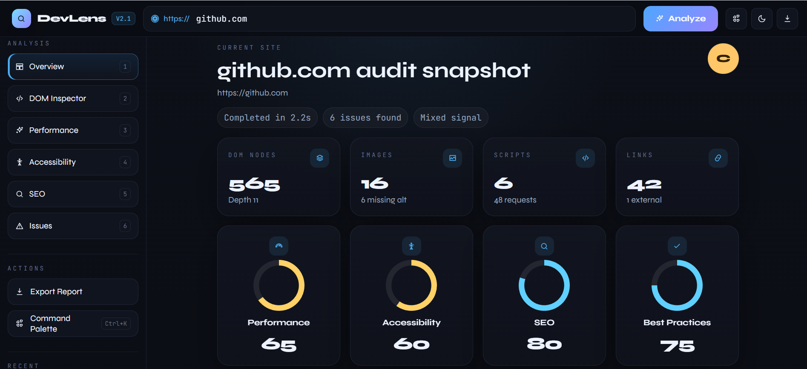
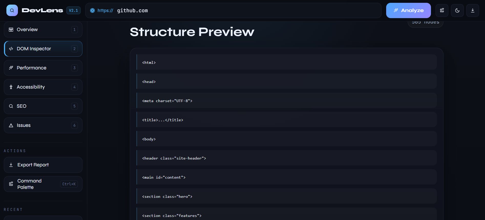
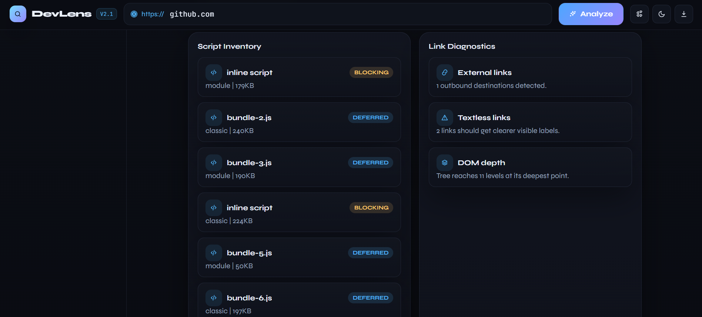
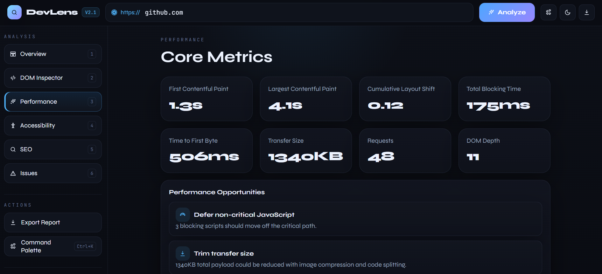
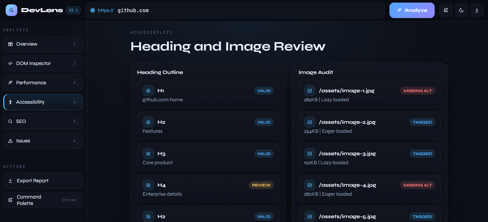
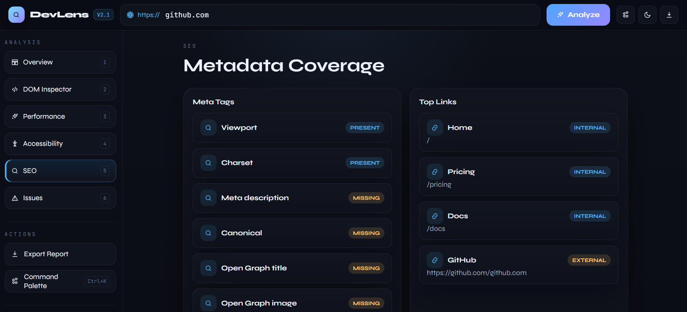
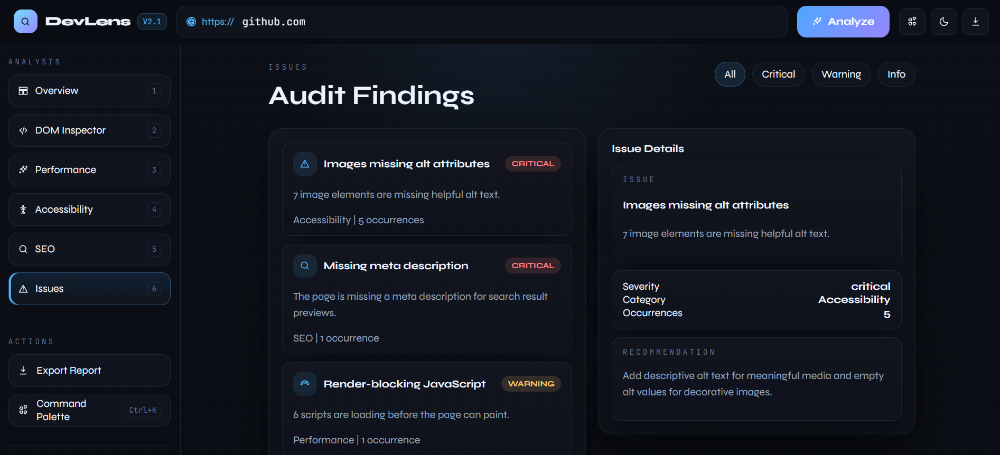
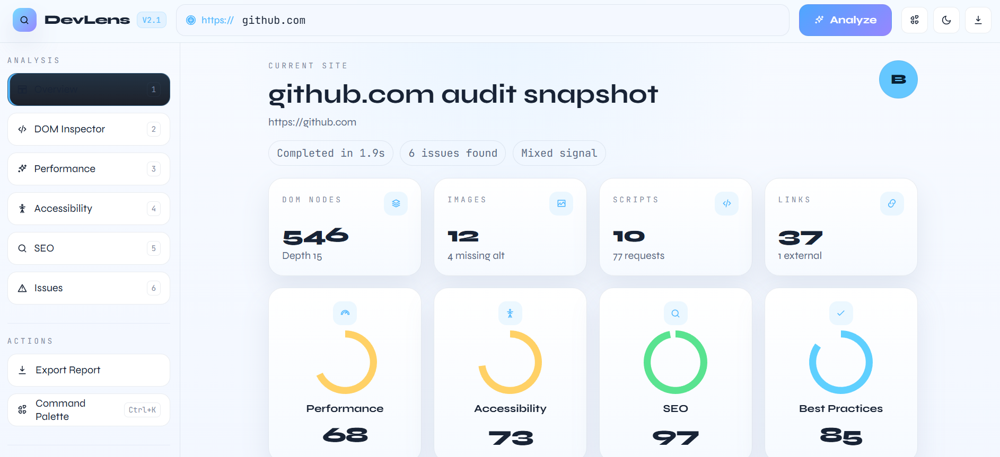

# DevLens Website Behavior Analyzer

DevLens is a front-end website audit dashboard that simulates the kind of analysis a modern web inspector might provide. It lets a user enter a URL and then view mock results for structure, performance, accessibility, SEO, and issue severity in a polished interactive UI.

This project is designed as a portfolio-friendly static web app. It is especially useful for learning how HTML, CSS, and JavaScript work together in a dashboard-style interface.


## Preview












## Features

- Analyze a website URL with a single input and action button
- View six main sections:
  - Overview
  - DOM Inspector
  - Performance
  - Accessibility
  - SEO
  - Issues
- Explore score cards, charts, issue summaries, and detail panels
- Export mock audit data as JSON or HTML
- Switch between dark and light theme
- Use a responsive layout for desktop, tablet, and mobile screens

## Project Structure

```
DevLens Website Behavior Analyzer/
|-- assets/
|   |-- css/
|   |   `-- style.css
|   `-- js/
|       `-- script.js
|-- index.html
`-- README.md
```

## Technologies Used

- HTML5
- CSS3
- JavaScript (Vanilla JS)
- [Chart.js](https://www.chartjs.org/) for charts
- Google Fonts for typography

## How It Works

The app currently uses mock data instead of running a real live crawl of a website.

When a user enters a URL and presses Analyze:

1. JavaScript normalizes the URL input.
2. A mock analysis object is generated.
3. The app stores that data in memory.
4. The dashboard updates the visible section cards, charts, metrics, and issue lists.

This means the project is focused on front-end interaction, rendering, layout, and user experience rather than backend crawling or real network analysis.

## Main Concepts Used

- **DOM Manipulation** – Selecting, traversing, and dynamically updating elements  
- **DOM Parsing** – Using `DOMParser` to analyze external HTML structure  
- **Event Handling** – Managing user interactions (clicks, inputs, UI controls)  
- **Asynchronous JavaScript** – Handling async operations with `fetch` and Promises  
- **ES6+ Features** – Arrow functions, destructuring, modules, template literals  
- **Responsive Design** – Building layouts with Flexbox and CSS Grid  
- **Component-Based Structure (Vanilla JS)** – Organizing code into reusable modules  
- **Data Visualization** – Displaying insights using charts (e.g., Chart.js)  
- **Conditional Rendering** – Dynamically showing insights, warnings, and states  
- **State Management (Basic)** – Managing app state without frameworks  
- **Accessibility Analysis** – Detecting issues like missing `alt` attributes  
- **Performance Heuristics** – Estimating load and optimization opportunities  
- **UI/UX Design Principles** – Clean layout, hierarchy, and interactive feedback  
- **Local Storage (Optional)** – Saving previous analyses  

### 1. Separation of concerns

- `index.html` contains the structure
- `assets/css/style.css` contains the design and responsive rules
- `assets/js/script.js` contains the app behavior

### 2. State management

The app keeps track of current data, active section, selected filter, theme, and recent analyses inside a shared JavaScript `state` object.

### 3. DOM manipulation

JavaScript updates the page by targeting elements with IDs and classes, then changing text, visibility, and generated HTML blocks.

### 4. Responsive design

CSS media queries adapt the layout for:

- Desktop
- Tablet
- Mobile

The app uses grid and flexbox so the interface can rearrange cleanly on smaller screens.

### 5. Component-style rendering

Even without a framework like React, the app uses reusable rendering functions to generate UI blocks such as:

- score cards
- issue cards
- stack items
- metric panels

## Running the Project

Because this is a static project, you can run it very simply:

1. Open `index.html` in a browser

Or, if you prefer using a local server:

1. Open the project folder in VS Code
2. Use a simple live server extension
3. Launch the page in your browser

## Responsive Behavior

- Desktop keeps the analysis rail and main content side by side
- Tablet stacks the content and sidebar cleanly
- Mobile uses a single-column layout with wrapped top-bar controls

## Future Improvements

- Connect the app to a real website analysis API
- Add a true command palette modal
- Save report history in local storage
- Add screenshots or branded assets
- Support GitHub Pages deployment

## Author
Created by Subhan.

GitHub: https://github.com/Subhan46-web

LinkedIn: linkedin.com/in/subhanraza
